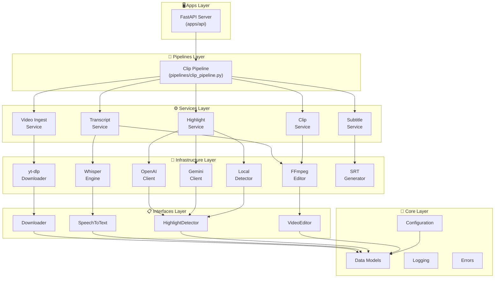
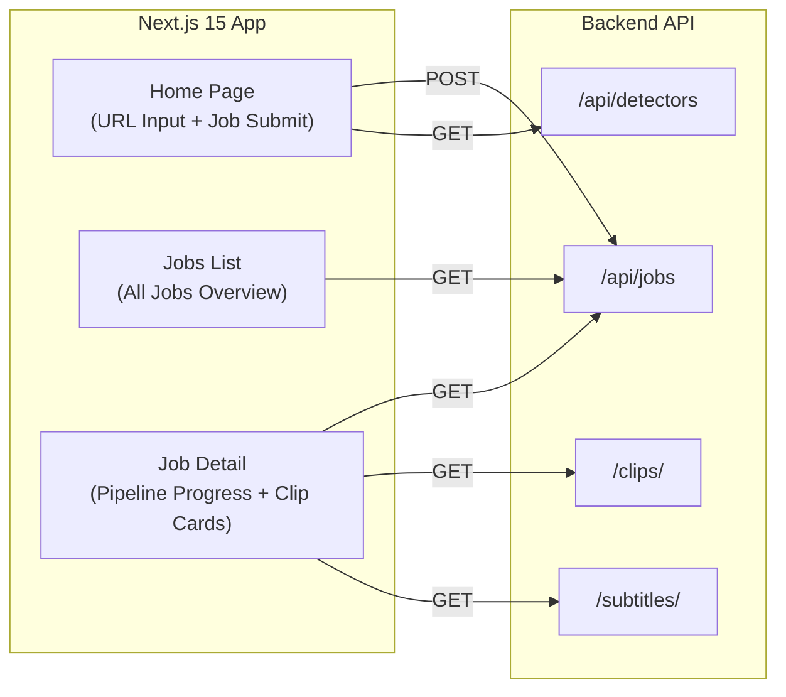

# 🏗️ System Architecture

AutoClip Pro follows a **layered clean architecture** where each layer has strict responsibilities and dependencies flow in one direction only.

## Architecture Diagram



## Dependency Direction

All dependencies **must** follow this direction (top → bottom):

```
apps → pipelines → services → infra → interfaces → core
```

**Forbidden:**
- `core` importing `services` ❌
- `infra` importing `services` ❌
- `services` importing `pipelines` ❌

## Layer Descriptions

### Core (`core/`)
Fundamental building blocks: data models, configuration, logging, shared exceptions.
Core **must not** depend on any other module.

### Interfaces (`interfaces/`)
Abstract contracts that define system boundaries:
- `Downloader` — video download contract
- `SpeechToText` — transcription contract
- `HighlightDetector` — AI analysis contract
- `VideoEditor` — video editing contract

### Infrastructure (`infra/`)
External integrations that implement interfaces:
- `yt-dlp` — YouTube downloader with multi-strategy fallback
- `Whisper` — OpenAI speech-to-text engine
- `OpenAI / Gemini / Local` — highlight detection engines
- `FFmpeg` — video cutting, encoding, and vertical formatting

### Services (`services/`)
Business logic orchestrating infra components:
- `VideoIngestService` — manages video download flow
- `TranscriptService` — handles audio extraction + transcription
- `HighlightService` — coordinates highlight detection
- `ClipService` — generates clips from highlights
- `SubtitleService` — creates SRT subtitles per clip

### Pipelines (`pipelines/`)
Workflow orchestration calling services in sequence.

### Apps (`apps/`)
Entry points: FastAPI server, background workers.

## Frontend Architecture


