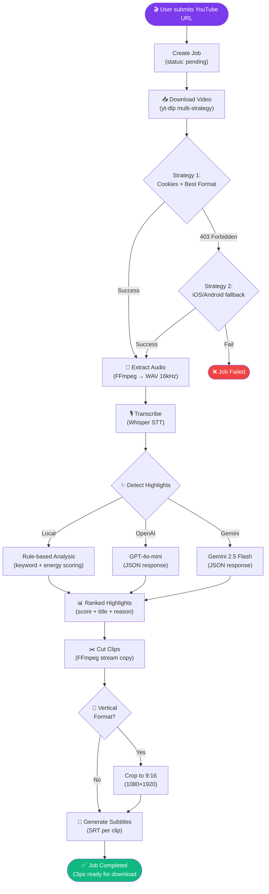
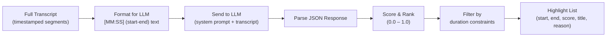
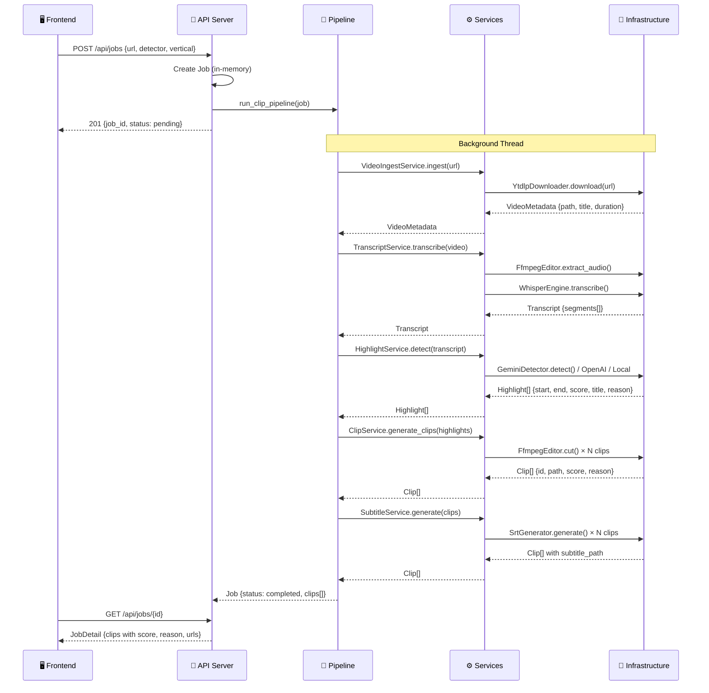
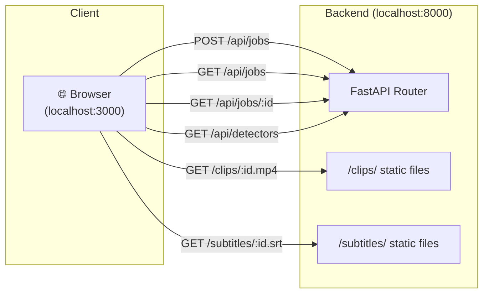
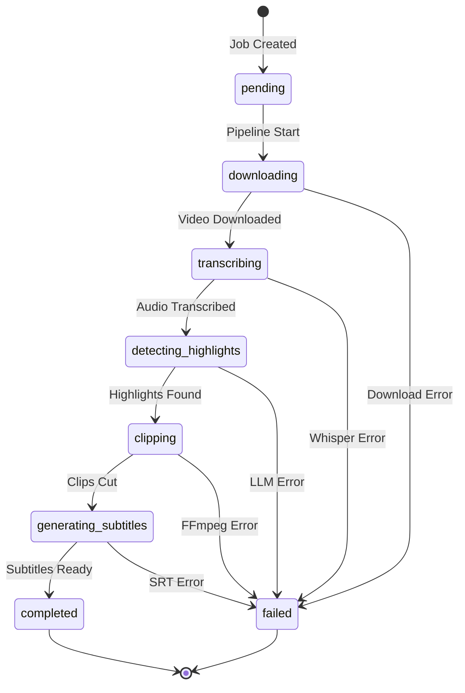

# 🔄 System Flow

Detailed pipeline flow diagrams for all AutoClip Pro processing workflows.

## Main Clip Generation Pipeline

This is the primary workflow triggered when a user submits a YouTube URL.

## Highlight Detection Flow

How the AI analyzes transcripts and scores moments.

## Data Flow Through Architecture Layers

## API Request Flow

## Job State Machine

